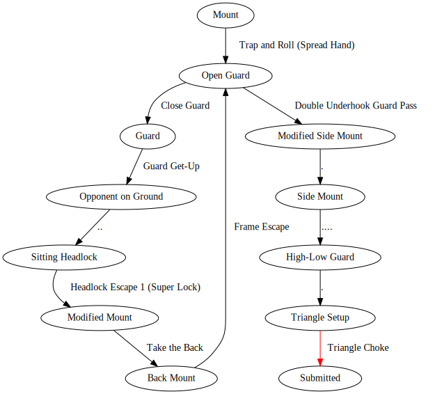

# bjj-graph

An exploration of graphing the positions and techniques in Brazilian jiu-jitsu.

## Models

### v1



> _This is a randomly generated subgraph, starting at Mount and randomly
> choosing valid techniques and positions until a submission occurs. The full
> graph is much too large to display here!_

My first stab at this (2021-2024) reflected my simplistic understanding of
jiu-jitsu as a beginner. The initial idea was that when you are in a position
(node), there are a set of techniques (edges) that you can use to take you into
a new position.

For example, when you are on the bottom of the Mount position, you can perform a
Trap and Roll technique to take you to the top of Open Guard.

### v2

> TODO: Implement this new approach and include a graph here

As my practice and understanding of jiu-jitsu developed, I realized that the
model should be more nuanced. When you execute a Trap and Roll, your opponent
can counter with Super Hooks, and the outcome is that you're still in the bottom
of the Mount position.

I had left out techniques like Super Hooks from the v1 model, because it didn't
seem like there was a natural place for them. The v2 model solves this problem
by modeling both positions _and_ techniques as nodes. A node represents a
temporary state, and my higher-level understanding of jiu-jitsu now tells me
that when you are either holding a position or executing a technique, those are
both states that can be explored, with various outcomes depending on what your
opponent is doing.

## Graph visualization

This project uses the ubergraph library to construct the graph and graphviz
(which is built into ubergraph) to generate visualizations.

`bin/viz-graph` is a CLI entrypoint that wraps `ubergraph.core/viz-graph` to
graph the BJJ positions and techniques. the options are passed into `viz-graph`,
and the `:layout :dot` option is included by default.

Example usage:

```bash
# Display graph in a dedicated window
bin/viz-graph

# Save graph as SVG file (e.g. /tmp/bjj-graph-2024-01-11.svg) and open it in
# Firefox
filename="/tmp/bjj-graph-$(date '+%Y-%m-%d').svg"
bin/viz-graph "{:save {:format :svg, :filename \"$filename\"}}"
firefox "$filename"

# Refer to `(doc ubergraph.core/viz-graph)` for more options
clojure -e \
  "(require '[clojure.repl :as repl] '[ubergraph.core :as uber])
   (repl/doc uber/viz-graph)"
```

## Random sequence generation

As a result of modeling jiu-jitsu as a graph, we can randomly generate valid
sequences of techniques and positional changes.

### `bin/random-sequence`

`bin/random-sequence` starts at a random position and keeps generating steps
(either a technique or a transition to a new position that is easily accessible
from the current one) until a submission occurs:

```
$ bin/random-sequence
Over-Under Clinch
Pummel
Body Fold Takedown
Twisting Arm Control
Take the Back
Frame Escape
Double Underhook Guard Pass
Reverse Cross-Chest
Mount Transition (High Step)
Americana Armlock (Standard)
```

### `bin/random-subgraph`

> _The graphs above were generated via this script._

`bin/random-subgraph` takes a starting position and an optional length and
generates steps in the same way as `random-sequence`, but rather than printing
the steps in text form, it visualizes the subgraph that the randomly generated
steps comprise.

```bash
# Start from a random position and keep generating steps until a submission
# happens. Display the graph.
bin/random-subgraph

# Start from Guard and generate a sequence of length ~5. (The actual length may
# be less than 5, in cases where we go down a path where the only definide
# options are submissions.) Display the graph.
bin/random-subgraph '{:start-position "Guard", :length 5}'

# Start from Mount and keep generating steps until a submission happens. Save
# the graph as a PNG file and then open it in Firefox.
filename="/tmp/random-subgraph.png"
bin/random-subgraph \
  "{:start-position \"Mount\",
    :viz-graph-opts {:save {:format :png, :filename \"$filename\"}}}"
firefox "$filename"
```

## License

Copyright © 2021-2024 Dave Yarwood

Distributed under the Eclipse Public License version 2.0.
